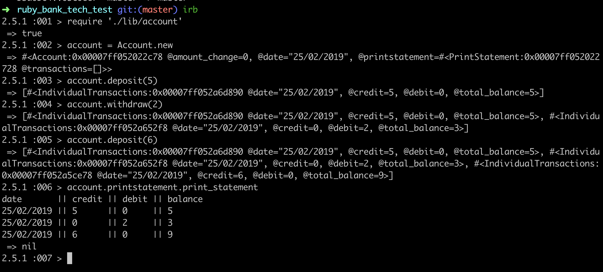

# Bank tech test - Beatrice Courage


# Makers Academy Specification

Requirements
-----
* You should be able to interact with the your code via a REPL like IRB or the JavaScript console. (You don't need to implement a command line interface that takes input from STDIN.)
* Deposits, withdrawal.
* Account statement (date, amount, balance) printing.
* Data can be kept in memory (it doesn't need to be stored to a database or anything).

Acceptance Criteria
-----
Given a client makes a deposit of 1000 on 10-01-2012
And a deposit of 2000 on 13-01-2012
And a withdrawal of 500 on 14-01-2012
When she prints her bank statement
Then she would see:

```
date       || credit || debit   || balance
14/01/2012 ||        || 500.00  || 2500.00
13/01/2012 || 2000.00||         || 3000.00
10/01/2012 || 1000.00||         || 1000.00
```


# Completed Bank Tech Test:


User Stories
-----
```
As a user,
So that I can add money to my account (credit),
I would like to make a deposit.

As a user,
So that I can remove money from my account (debit),
I would like to make a withdrawal.

As a user,
So that I know how much money I have,
I would like to see my bank statement which includes date, credit, debit, balance.


```
Testing
-----
* A strict TDD process was used throughout
* Consists of  both feature and unit tests - all tests passing - 25 passing tests
* Each test has a clear test description
* Testing framework - RSpec
* TDD approach - 'Red Green Refactor' loop. This involves first writing a failing test, and then producing a minimum amount of code to pass that test.

Design
-----
* Program consists of three separate classes that can be reasonably justified
* All methods are fewer than 7 lines
* All classes are fewer than 30 lines


Set Up
-----
* Clone this repository
```
$ git clone git@github.com:beacourage/Bank_tech_test.git
```
* Go into the Bank_tech_test repository
```
$ cd Bank_tech_test
```
* Install gems contained in the Gemfile
```
$ bundle install
```
* Run tests from root of the directory to see all tests passing
```
$ rspec
```
Running the App
-----

* From the command line, launch irb to interact with code, and require the necessary files.

```
$ irb
$ require './lib/account'
```

* Running the app from the command line:

 
